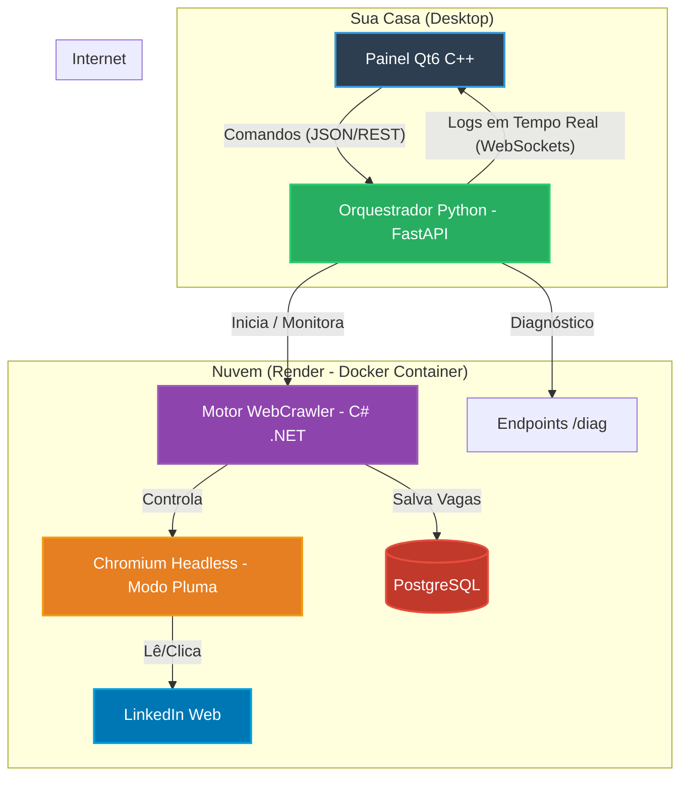

# 📐 Arquitetura Técnica - Sistema LinkDim

Este diagrama ilustra como os componentes do sistema interagem entre o seu computador local e a infraestrutura na nuvem (Render).

## 🛠️ Detalhes das Camadas

1.  **Painel Qt (C++ / Desktop)**: Sua interface de comando. Ela não precisa de muita internet, apenas envia as ordens (Start/Stop) e exibe os logs que vêm da nuvem.
2.  **Orquestrador (Python / FastAPI)**: É o "gerente". Ele fica de plantão 24h no Render recebendo seus comandos e garantindo que o robô em C# esteja rodando.
3.  **Motor Crawler (C# / .NET 8)**: É a "força bruta". Ele carrega a inteligência de busca, navegação humana e bypass de segurança.
4.  **Chromium (Modo Pluma)**: O navegador "invisível". Configuramos ele para ser ultra-leve (sem imagens) para caber na memória do Render.
5.  **PostgreSQL**: Onde a sua lista de vagas fica guardada com segurança para que você nunca perca uma oportunidade.

---
**Status da Obra:** Engenharia concluída. Pronto para escala! 👊🤖💎🚀
